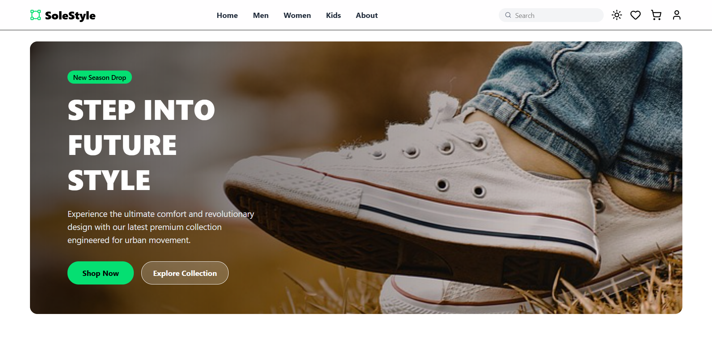

# SoleStyle – E-Commerce Shoes Store

SoleStyle is a modern fashion e-commerce web application built to demonstrate a complete shopping experience including product browsing, filtering, and cart functionality. The project focuses on responsive UI design, modular component architecture, and efficient state management in a React-based environment.

This project serves as a practical implementation of frontend development concepts such as component-based architecture, routing, state management, and responsive layout design.

---
## Live Demo

---

## Table of Contents

- Overview
- Features
- Tech Stack
- Project Structure

---

## Overview

SoleStyle is a frontend e-commerce platform designed for fashion products. The application provides users with a clean interface to explore products, filter them based on preferences, and manage items in a shopping cart.

The project emphasizes:

- Clean UI/UX
- Scalable component structure
- Efficient data handling
- Responsive design across devices

This repository is primarily intended as a learning project and portfolio demonstration for modern frontend development practices.

---

## Features

- Responsive e-commerce user interface
- Product listing and product cards
- Category-based browsing
- Product filtering functionality
- Add to cart system
- Search functionality
- Modern navigation bar
- Mobile responsive design
- Component-based architecture

---

## Tech Stack

Frontend Technologies:

- React.js
- JavaScript (ES6+)
- Tailwind CSS
- HTML5
- CSS3

Libraries and Tools:

- React Router DOM
- Lucide Icons
- Local Storage for persistence
- Vite (Build Tool)

Development Tools:

- Git
- GitHub
- VS Code

---

## Project Structure
SoleStyle/
│── src/
│   ├── components/     # Reusable UI components
│   ├── pages/          # Page-level components
│   ├── context/        # Global state management
│   ├── assets/         # Images and static files
│   ├── App.jsx         # Main application
│   └── main.jsx        # Entry point
│
│── public/
│── package.json
│── vite.config.js